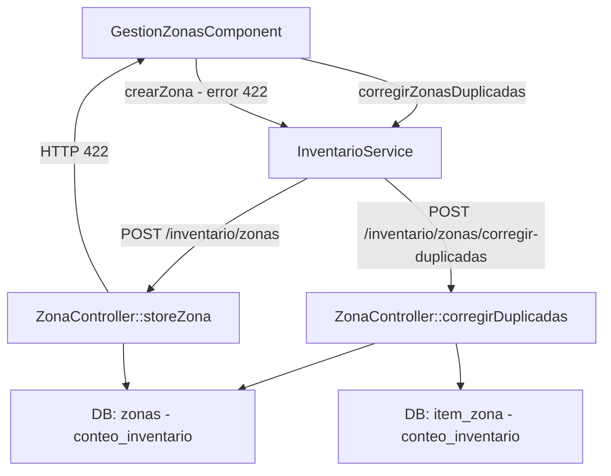
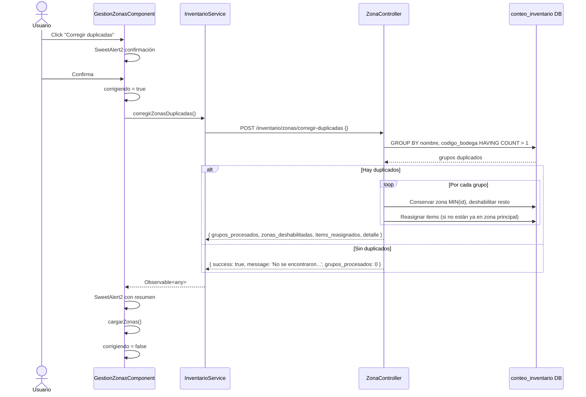
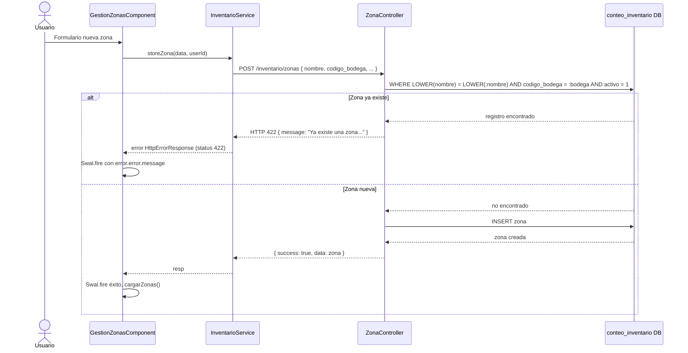

# Design Document: fix-zonas-duplicadas

## Bug Details

**Bug**: El módulo de inventario permite crear zonas con el mismo nombre dentro de la misma bodega, generando duplicados silenciosos. Los ítems asignados a zonas duplicadas quedan en estado inconsistente y es imposible determinar cuál zona es la correcta.

**Affected files**:
- `Saint-Backend/app/Http/Controllers/Inventario/ZonaController.php`
- `Saint-Backend/app/Models/Inventario/Zona.php`
- `Saint-Backend/routes/api.php`
- `Saint/src/app/services/inventario.service.ts`
- `Saint/src/app/pages/inventario/gestion-zonas/gestion-zonas.component.ts`
- `Saint/src/app/pages/inventario/gestion-zonas/gestion-zonas.component.html`

## Expected Behavior

1. `POST /inventario/zonas` debe rechazar con HTTP 422 si ya existe una zona activa con el mismo nombre (case-insensitive) en la misma bodega.
2. `POST /inventario/zonas/corregir-duplicadas` debe detectar todos los grupos duplicados, conservar la zona de menor `id` como principal, deshabilitar las demás, reasignar ítems huérfanos y devolver un resumen JSON.
3. El frontend debe mostrar el mensaje de error del servidor (422) al crear una zona duplicada, y exponer un botón "Corregir duplicadas" con confirmación y resumen de resultados.

## Hypothesized Root Cause

`ZonaController::storeZona()` no realiza ninguna verificación de unicidad antes de insertar: llama directamente a `Zona::crearZona()` sin comprobar si existe ya una zona activa con el mismo `(nombre, codigo_bodega)`. No existe restricción UNIQUE en la tabla `zonas` para esa combinación, por lo que la base de datos acepta inserciones duplicadas silenciosamente.

## Fix Implementation

- **Backend**: Agregar `Zona::existeDuplicado()` y usarlo en `storeZona` para retornar 422 ante duplicados. Agregar `Zona::gruposDuplicados()` y el nuevo método `ZonaController::corregirDuplicadas()`. Registrar la nueva ruta.
- **Frontend**: Agregar `corregirZonasDuplicadas()` en `InventarioService`, método `corregirDuplicadas()` con SweetAlert2 de confirmación y resumen en `GestionZonasComponent`, manejo diferenciado del error 422 en `crearZona()`, y botón en el template HTML.

## Glossary

- **Zona principal**: La zona de menor `id` dentro de un grupo duplicado; es la que se conserva activa.
- **Zona duplicada**: Cualquier zona del grupo que no es la principal; se deshabilita.
- **Grupo duplicado**: Conjunto de zonas con mismo `nombre` y `codigo_bodega` que tienen `activo = true`.
- **Ítem huérfano**: Ítem cuya única asignación de zona apunta a una zona duplicada (no a la principal).
- **Reasignación**: Cambiar el `id_zona` de un registro `item_zona` de la zona duplicada a la zona principal.

## Overview

El bugfix corrige dos problemas relacionados en el módulo de inventario: (1) la ausencia de validación que impide crear zonas con nombre duplicado dentro de la misma bodega, y (2) la falta de una herramienta de corrección que consolide los duplicados ya existentes en base de datos reasignando ítems a la zona principal y deshabilitando las redundantes.

La solución se implementa en dos capas: un nuevo endpoint Laravel `POST /inventario/zonas/corregir-duplicadas` para la corrección masiva controlada, una validación única en `storeZona`, un nuevo método en `InventarioService` de Angular, y cambios en `GestionZonasComponent` para exponer la funcionalidad al usuario.

---

## Architecture



---

## Sequence Diagrams

### Flujo: Corrección de duplicadas



### Flujo: Creación con validación duplicado



---

## Components and Interfaces

### Component 1: ZonaController (Laravel)

**Propósito**: Gestionar el ciclo de vida de zonas. Se añaden dos responsabilidades: validar unicidad en creación y ejecutar la corrección de duplicadas.

**Métodos nuevos/modificados**:

```php
// Modificación: storeZona — agrega validación unique case-insensitive
public function storeZona(Request $request): JsonResponse

// Nuevo: corregirDuplicadas
public function corregirDuplicadas(Request $request): JsonResponse
```

**Responsabilidades**:
- `storeZona`: Valida que no exista zona con mismo nombre (case-insensitive) para el mismo `codigo_bodega` antes de insertar. Retorna 422 con mensaje legible si hay conflicto.
- `corregirDuplicadas`: Detecta grupos duplicados, conserva zona principal (MIN id), deshabilita las demás, reasigna ítems huérfanos, devuelve resumen JSON.

---

### Component 2: Zona (Model — Laravel)

**Propósito**: Encapsula acceso a la tabla `zonas` en la conexión `conteo_inventario`.

**Métodos nuevos**:

```php
// Verifica si existe zona activa con mismo nombre (case-insensitive) para la bodega
public static function existeDuplicado(string $nombre, string $codigoBodega): bool

// Busca grupos duplicados: misma (nombre, codigo_bodega) con más de 1 registro activo
public static function gruposDuplicados(): Collection
```

---

### Component 3: InventarioService (Angular)

**Propósito**: Capa de comunicación HTTP con el backend Laravel desde Angular.

**Método nuevo**:

```typescript
corregirZonasDuplicadas(): Observable<any> {
  return this.http.post(`${this.apiLaravelUrl}/inventario/zonas/corregir-duplicadas`, {});
}
```

---

### Component 4: GestionZonasComponent (Angular)

**Propósito**: UI de gestión de zonas; muestra lista, permite crear zonas y gestionar ítems por zona.

**Propiedades nuevas**:
```typescript
corrigiendo = false;
```

**Métodos nuevos/modificados**:

```typescript
// Nuevo: confirmación + llamada al endpoint + resumen SweetAlert2
corregirDuplicadas(): void

// Modificado: manejo diferenciado de error HTTP 422
crearZona(data: any): void
```

---

## Data Models

### Tabla: `zonas` (conexión `conteo_inventario`)

| Campo | Tipo | Descripción |
|---|---|---|
| `id` | int (PK, AI) | Identificador único |
| `nombre` | varchar | Nombre de la zona |
| `descripcion` | varchar\|null | Descripción opcional |
| `codigo_bodega` | varchar | Código de bodega propietaria |
| `activo` | boolean | `true` = activa, `false` = deshabilitada |
| `created_at` | timestamp | Fecha creación |
| `updated_at` | timestamp | Fecha actualización |

**Restricción nueva (lógica, no DDL)**: `UNIQUE(LOWER(nombre), codigo_bodega)` donde `activo = 1`, aplicada en la capa de aplicación.

### Tabla: `item_zona` (conexión `conteo_inventario`)

| Campo | Tipo | Descripción |
|---|---|---|
| `id` | int (PK, AI) | Identificador único |
| `codigo_item` | varchar | Código del ítem |
| `id_f400` | int | ID en F400 |
| `codigo_bodega` | varchar | Código de bodega |
| `id_zona` | int (FK) | Zona a la que pertenece |
| `activo` | boolean | Estado de la asignación |

### DTO de respuesta: `corregirDuplicadas`

```typescript
interface CorreccionDuplicadasResponse {
  success: boolean;
  message?: string;              // solo cuando grupos_procesados = 0
  grupos_procesados: number;
  zonas_deshabilitadas: number;
  items_reasignados: number;
  detalle: Array<{
    bodega: string;
    nombre_zona: string;
    zona_principal_id: number;
    zonas_deshabilitadas: number[];
    items_reasignados: number;
  }>;
}
```

---

## Algorithmic Pseudocode

### Algoritmo: `corregirDuplicadas`

```pascal
PROCEDURE corregirDuplicadas()
  OUTPUT: CorreccionDuplicadasResponse

  grupos ← SELECT nombre, codigo_bodega, COUNT(*) as total
           FROM zonas
           WHERE activo = true
           GROUP BY nombre, codigo_bodega
           HAVING total > 1

  IF grupos IS EMPTY THEN
    RETURN { success: true, message: 'No se encontraron zonas duplicadas',
             grupos_procesados: 0, zonas_deshabilitadas: 0,
             items_reasignados: 0, detalle: [] }
  END IF

  totalGrupos ← 0
  totalDeshabilitadas ← 0
  totalItemsReasignados ← 0
  detalle ← []

  FOR EACH grupo IN grupos DO
    zonasGrupo ← SELECT * FROM zonas
                 WHERE nombre = grupo.nombre
                   AND codigo_bodega = grupo.codigo_bodega
                   AND activo = true
                 ORDER BY id ASC

    zonaPrincipal ← zonasGrupo[0]          // MIN id
    duplicadas ← zonasGrupo[1..]           // resto

    itemsReasignadosGrupo ← 0

    FOR EACH zonaDup IN duplicadas DO
      itemsDup ← SELECT * FROM item_zona
                 WHERE id_zona = zonaDup.id AND activo = true

      FOR EACH item IN itemsDup DO
        yaEnPrincipal ← EXISTS (
          SELECT 1 FROM item_zona
          WHERE codigo_item = item.codigo_item
            AND id_f400 = item.id_f400
            AND codigo_bodega = item.codigo_bodega
            AND id_zona = zonaPrincipal.id
            AND activo = true
        )

        IF NOT yaEnPrincipal THEN
          UPDATE item_zona SET id_zona = zonaPrincipal.id
          WHERE id = item.id
          itemsReasignadosGrupo ← itemsReasignadosGrupo + 1
        END IF
      END FOR

      UPDATE zonas SET activo = false WHERE id = zonaDup.id
      totalDeshabilitadas ← totalDeshabilitadas + 1
    END FOR

    totalGrupos ← totalGrupos + 1
    totalItemsReasignados ← totalItemsReasignados + itemsReasignadosGrupo

    detalle.append({
      bodega: grupo.codigo_bodega,
      nombre_zona: grupo.nombre,
      zona_principal_id: zonaPrincipal.id,
      zonas_deshabilitadas: duplicadas.map(z => z.id),
      items_reasignados: itemsReasignadosGrupo
    })
  END FOR

  RETURN {
    success: true,
    grupos_procesados: totalGrupos,
    zonas_deshabilitadas: totalDeshabilitadas,
    items_reasignados: totalItemsReasignados,
    detalle: detalle
  }
END PROCEDURE
```

**Precondiciones**:
- Conexión `conteo_inventario` disponible.
- Tabla `zonas` e `item_zona` existen con estructura esperada.

**Postcondiciones**:
- Para cada grupo duplicado: exactamente una zona queda con `activo = true` (la de menor `id`).
- Ningún ítem que estaba en una zona deshabilitada queda huérfano: o fue reasignado a la principal o ya estaba en ella.
- Las zonas sin duplicados y sus ítems no son tocados.

**Invariante de bucle externo** (por cada grupo procesado):
- `totalGrupos` refleja exactamente la cantidad de grupos completamente procesados hasta ese punto.

---

### Algoritmo: Validación `storeZona` (modificación)

```pascal
PROCEDURE storeZona(request)
  nombre ← request.nombre
  codigoBodega ← request.codigo_bodega

  existeDuplicado ← EXISTS (
    SELECT 1 FROM zonas
    WHERE LOWER(nombre) = LOWER(:nombre)
      AND codigo_bodega = :codigoBodega
      AND activo = true
  )

  IF existeDuplicado THEN
    RETURN HTTP 422 {
      message: "Ya existe una zona con el nombre '{nombre}' en esta bodega."
    }
  END IF

  // ... lógica existente de creación ...
END PROCEDURE
```

---

## Key Functions with Formal Specifications

### `Zona::existeDuplicado(string $nombre, string $codigoBodega): bool`

**Precondiciones**:
- `$nombre` es una cadena no vacía.
- `$codigoBodega` es una cadena no vacía.

**Postcondiciones**:
- Retorna `true` si y solo si existe al menos una zona con `activo = true`, `codigo_bodega = $codigoBodega` y `LOWER(nombre) = LOWER($nombre)`.
- No produce efectos secundarios.

---

### `ZonaController::corregirDuplicadas()`

**Precondiciones**:
- El usuario tiene acceso autenticado al endpoint (middleware existente del grupo `inventario`).

**Postcondiciones**:
- Si no hay duplicados → HTTP 200 con `grupos_procesados: 0`.
- Si hay duplicados → HTTP 200 con resumen completo y la base de datos en estado sin duplicados activos.
- Ninguna zona sin duplicados es modificada.
- Ningún `item_zona` activo es eliminado; solo reasignado.

---

### `corregirDuplicadas()` (GestionZonasComponent)

**Precondiciones**:
- `corrigiendo = false` al inicio.

**Postcondiciones**:
- Si el usuario cancela la confirmación: no se realiza ninguna llamada HTTP y `corrigiendo` permanece `false`.
- Si el usuario confirma: `corrigiendo = true` durante la llamada, `false` al terminar (éxito o error).
- Al finalizar exitosamente: se muestra el resumen SweetAlert2 y se recarga la lista de zonas.

---

## Error Handling

### Error 1: Zona duplicada en creación (`storeZona`)

**Condición**: `POST /inventario/zonas` con `nombre` ya existente (case-insensitive) para el mismo `codigo_bodega`.
**Respuesta backend**: HTTP 422 `{ message: "Ya existe una zona con el nombre 'X' en esta bodega." }`
**Manejo frontend**: El `error` handler de `crearZona()` detecta `error.status === 422` y muestra `error.error.message` en un SweetAlert2 de tipo `warning`, en lugar del mensaje genérico.

### Error 2: Error inesperado en `corregirDuplicadas`

**Condición**: Excepción no controlada en el controller Laravel.
**Respuesta backend**: HTTP 500 `{ success: false, message: '...' }`
**Manejo frontend**: SweetAlert2 con mensaje de error genérico.

### Error 3: Sin duplicados encontrados

**Condición**: No hay zonas duplicadas.
**Respuesta backend**: HTTP 200 `{ success: true, message: 'No se encontraron zonas duplicadas', grupos_procesados: 0 }`
**Manejo frontend**: SweetAlert2 informativo que muestra el mensaje del servidor.

---

## Testing Strategy

### Unit Testing Approach

- Probar `Zona::existeDuplicado()` con casos: zona inexistente, zona activa misma bodega, zona inactiva misma bodega, zona activa diferente bodega, diferencia de mayúsculas/minúsculas.
- Probar la lógica de reasignación de ítems con un ítem que ya está en la zona principal vs. uno que no está.

### Property-Based Testing Approach

No se requiere PBT para este bugfix. Las funciones involucradas son operaciones de corrección de datos (no transformaciones puras con espacio de entrada grande). Las propiedades se verifican con pruebas de ejemplo específicas que cubren los invariantes del bugfix.

### Integration Testing Approach

- `POST /inventario/zonas` con nombre duplicado → verificar HTTP 422.
- `POST /inventario/zonas` con nombre único → verificar creación exitosa.
- `POST /inventario/zonas/corregir-duplicadas` con datos limpios → verificar respuesta sin duplicados.
- `POST /inventario/zonas/corregir-duplicadas` con duplicados → verificar deshabilitación y reasignación.

---

## Security Considerations

- El endpoint `POST /inventario/zonas/corregir-duplicadas` se registra dentro del grupo de rutas autenticadas existente (mismo middleware JWT/Sanctum del grupo `inventario`). No requiere configuración adicional de seguridad.
- La operación es destructiva en el sentido de que deshabilita zonas; se mitiga con el SweetAlert2 de confirmación en el frontend y el resumen devuelto en la respuesta.

---

## Dependencies

| Componente | Dependencia | Tipo |
|---|---|---|
| ZonaController | `App\Models\Inventario\Zona` | Interno |
| ZonaController | `App\Models\Inventario\ItemZona` | Interno |
| ZonaController | `Illuminate\Support\Facades\DB` | Laravel framework |
| GestionZonasComponent | `InventarioService` | Angular service |
| GestionZonasComponent | `sweetalert2` | npm package (ya instalado) |

---

## Correctness Properties

*Una propiedad es una característica que debe mantenerse verdadera en todas las ejecuciones válidas del sistema.*

### Property 1: Unicidad de zonas activas por bodega tras corrección

*Para cualquier* par `(nombre, codigo_bodega)`, después de ejecutar `corregirDuplicadas`, existe a lo sumo una zona activa con ese par en la base de datos.

**Validates: Requirements 2.1, 2.2**

### Property 2: Conservación de la zona principal

*Para cualquier* grupo de zonas duplicadas procesado, la zona conservada como activa es la de menor `id` dentro del grupo.

**Validates: Requirements 2.2**

### Property 3: Ningún ítem queda huérfano

*Para cualquier* ítem que estaba asignado (`activo = true`) a una zona antes de ejecutar la corrección, después de la corrección ese ítem tiene al menos una asignación activa a una zona activa de la misma bodega.

**Validates: Requirements 2.3, 2.4**

### Property 4: No reasignación duplicada

*Para cualquier* ítem que ya estaba asignado tanto a la zona principal como a una zona duplicada del mismo grupo, después de la corrección el ítem aparece exactamente una vez en la zona principal (no se crea un registro duplicado).

**Validates: Requirements 2.4**

### Property 5: Zonas sin duplicados no son afectadas

*Para cualquier* zona que no pertenece a ningún grupo duplicado, su estado `activo` y sus ítems asignados permanecen inalterados después de la corrección.

**Validates: Requirements 3.1, 3.2, 3.3**

### Property 6: Rechazo de zona duplicada en creación

*Para cualquier* par `(nombre, codigo_bodega)` donde ya existe una zona activa con ese nombre (comparación case-insensitive), el endpoint `POST /inventario/zonas` retorna HTTP 422 y no crea ningún registro nuevo en la tabla `zonas`.

**Validates: Requirements 2.7**
